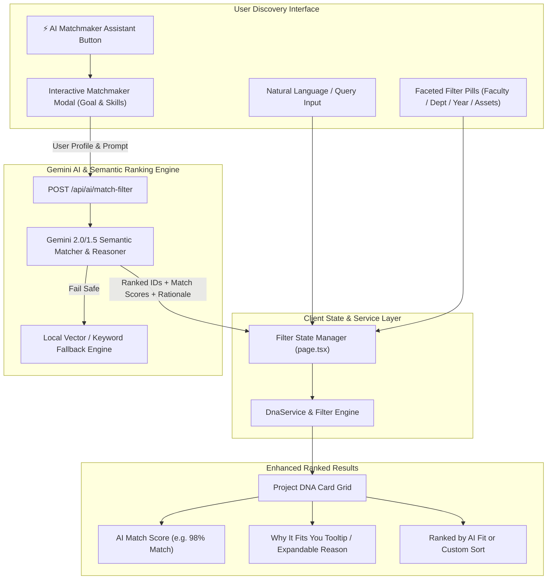

# AI Smart Project Matching & Intelligent Filtering System Plan

**Target System:** Project DNA Registry & Lineage Platform (KU CSC)  
**Goal:** พัฒนาระบบค้นหาและตัวกรองอัจฉริยะ (AI-Powered Semantic Matchmaker & Faceted Filter) ที่ช่วยให้นิสิตและนักวิจัยค้นหาโครงงานที่ "ตรงกับความต้องการ ทักษะ และเป้าหมายการต่อยอด" ได้อย่างแม่นยำ พร้อมการให้คะแนนความเหมาะสม (Match Score %) และเหตุผลประกอบจาก Gemini AI

---

## 1. System Architecture & Flow Diagram

---

## 2. Phased Implementation Breakdown

### Phase 1 — Backend AI Match & Semantic Filtering Engine
- **Endpoint:** `POST /api/ai/match-filter`
- **Input:** 
  - `user_query`: ข้อความความต้องการภาษาธรรมชาติ เช่น *"อยากได้โปรเจกต์ผ้าครามที่มี IoT และชุดข้อมูลภาพถ่ายเพื่อนำไปทำแอปมือถือต่อ"*
  - `user_profile`: (Optional) `{ target_faculty, current_skills: string[], goal: 'extend' | 'dataset' | 'inspiration', preferred_year }`
  - `project_candidates`: รายการสรุป DNA ของทุกโครงงานในระบบ
- **Logic:** 
  - วิเคราะห์ Semantic Fit, Tech Stack overlap, Gaps relevance, และ Feasibility
  - ส่งออก Array ของ `{ project_id, match_score: number (0-100), match_reasons: string[], learning_prerequisites: string[] }`
  - มี Smart Offline Fallback ในตัวหากเครือข่ายขัดข้อง

### Phase 2 — Advanced Faceted Filtering & Asset Quick-Filters
- ปรับปรุงแถบตัวกรองใน Header & Explore Tab:
  - **ตัวกรองทรัพยากร (Resource Availability Filters):**
    - `[💻 มี Source Code]`
    - `[📊 มี Dataset]`
    - `[🤖 มี Model/Weights]`
    - `[🌿 มีสายต่อยอด (Lineage)]`
  - **ตัวกรองปี พ.ศ.** และ **คณะ/สาขา** ทำงานร่วมกับ Search Query แบบ Multi-condition

### Phase 3 — Interactive AI Matchmaker Assistant UI
- เพิ่มปุ่ม **"⚡ ให้ AI ช่วยจับคู่โครงงาน"** ข้างช่องค้นหา
- Modal ผู้ช่วยอัจฉริยะ (Interactive Matchmaker Dialog):
  - Step 1: เลือกความสนใจหลัก / ปัญหาที่อยากแก้ (เช่น เกษตรแม่นยำ, สิ่งทอคราม, สุขภาพ, Smart City)
  - Step 2: เลือกทักษะที่มี (Python, AI/ML, IoT/Hardware, Web/Mobile, Management)
  - Step 3: เลือกเป้าหมาย (ต้องการนำโค้ดไปต่อยอด / ต้องการใช้ Dataset / หาหัวข้อวิจัย)
- กด **"ค้นหาโครงงานที่เหมาะสมที่สุด"** ➡️ ระบบคำนวณและแสดงผลทันที

### Phase 4 — Visual Card Enhancements with AI Match Badges
- ปรับแต่ง `DnaCard.tsx` และ `ProjectDetailDrawer.tsx`:
  - เมื่อเปิดโหมด AI Match: แสดง **AI Match Pill (เช่น 96% Match)** สี Amber/Emerald
  - แสดง Tooltip หรือแถบย่อย **"เหตุผลที่แนะนำ:"** สรุปสั้นๆ 1 บรรทัด
  - ตัวเลือกจัดเรียงผลลัพธ์: **"เรียงตามความเหมาะสม AI"**, **"ล่าสุด"**, **"ยอดต่อยอดสูงสุด"**

### Phase 5 — Verification & End-to-End Testing
- ทดสอบการทำงานร่วมกันระหว่าง Keyword Filter + AI Match
- ตรวจสอบประสิทธิภาพการตอบสนอง (`< 1.5s`)
- รัน `npm run build` และ Live Route Tests (0 Errors)

---

## 3. Success Metrics & Quality Gates
- **Accuracy:** ผลลัพธ์ที่ได้ตรงกับ Intent ของผู้ใช้ทั้งเชิงภาษาไทยและภาษาอังกฤษ
- **Resilience:** มี Offline Fallback เสมอ ไม่เกิดอาการค้างหรือหน้าขาว
- **Design Integrity:** สอดคล้องกับมาตรฐาน **Hallmark Design System** (สะอาด สบายตา ไร้ Slop)
